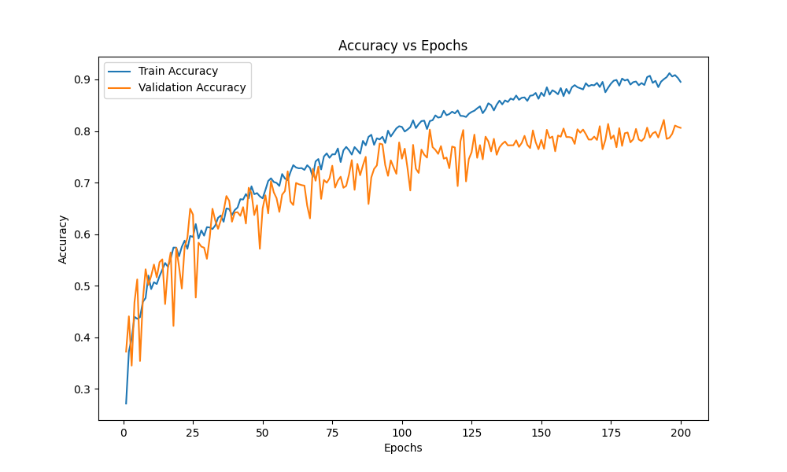
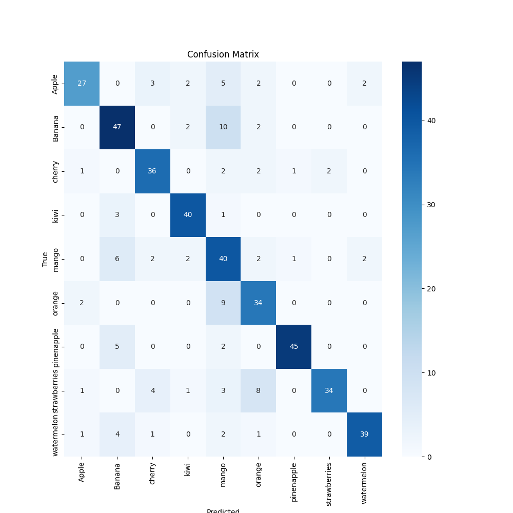

# Training Report for cnn

## Training Progress

## Metrics Summary

### Training Metrics

| Metric | Initial | Final | Best |
|--------|---------|-------|------|
| Loss   | 1.9345 | 0.4968 | 0.4891 |
| Accuracy | 0.2937 | 0.8368 | 0.8422 |

### Validation Metrics

| Metric | Initial | Final | Best |
|--------|---------|-------|------|
| Loss   | 1.8216 | 1.0741 | 0.8553 |
| Accuracy | 0.2969 | 0.6871 | 0.7473 |

## Training Details

- Total epochs: 200
- Validation frequency: Every 5 epochs

## Confusion Matrix

Test Loss: 0.8905
Test Precision: 0.7568
Test F1 Score: 0.7344