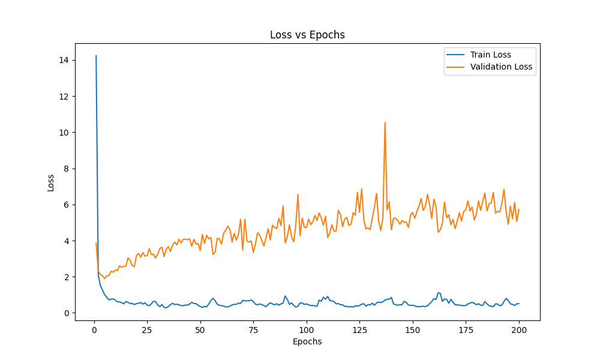
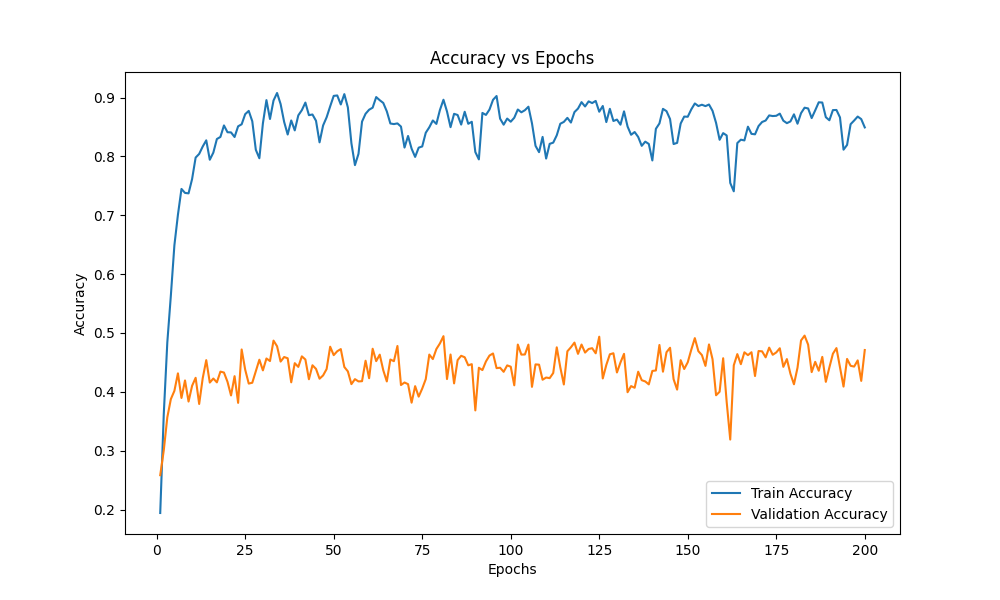
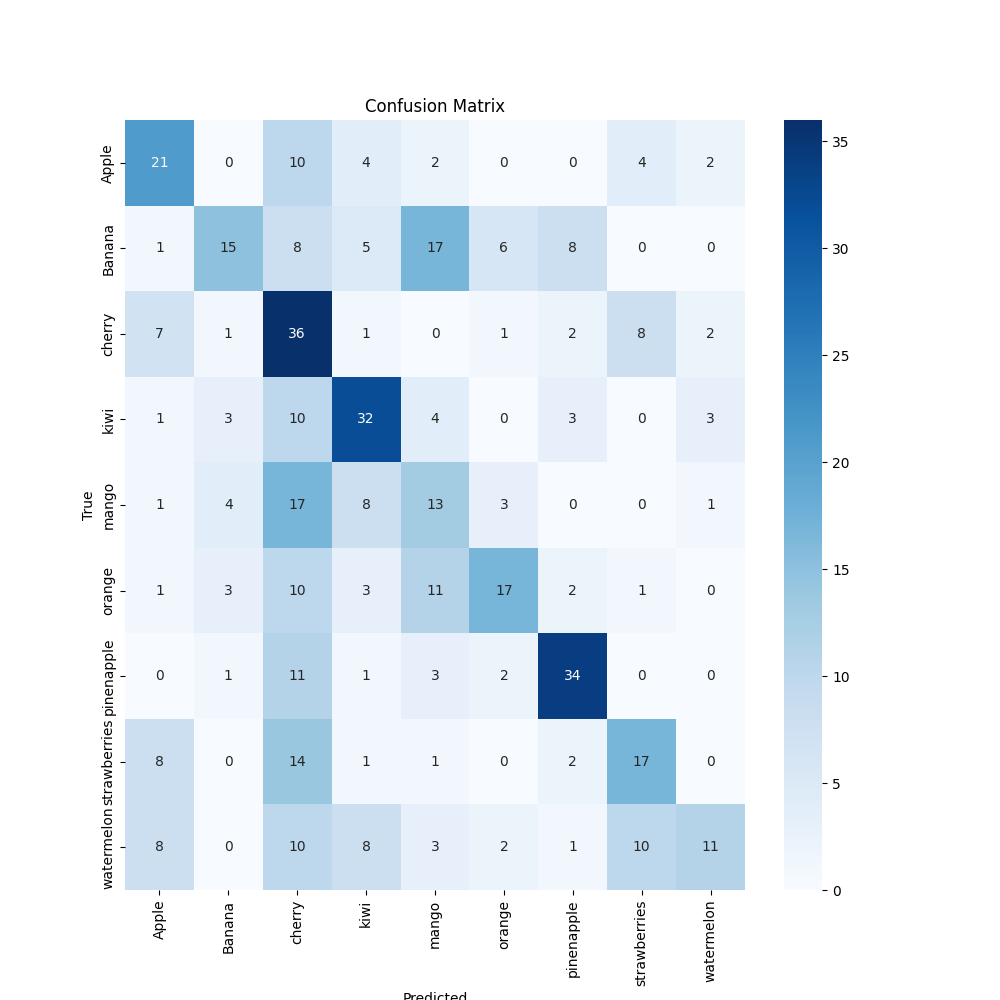

# Training Report for neural_net

## Training Progress

## Metrics Summary

### Training Metrics

| Metric | Initial | Final | Best |
|--------|---------|-------|------|
| Loss   | 14.2311 | 0.5131 | 0.2811 |
| Accuracy | 0.1941 | 0.8492 | 0.9077 |

### Validation Metrics

| Metric | Initial | Final | Best |
|--------|---------|-------|------|
| Loss   | 3.8565 | 5.7254 | 1.9015 |
| Accuracy | 0.2583 | 0.4710 | 0.4955 |

## Training Details

- Total epochs: 200
- Validation frequency: Every 5 epochs

## Confusion Matrix

Test Loss: 8.1413
Test Precision: 0.4734
Test F1 Score: 0.4216